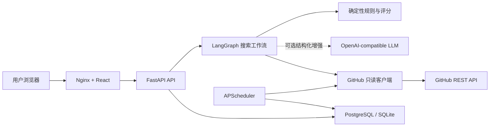
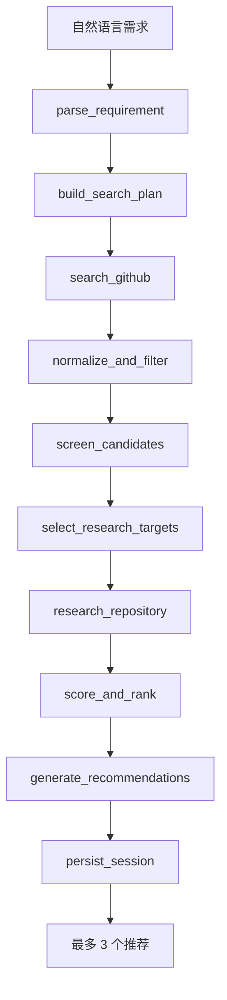
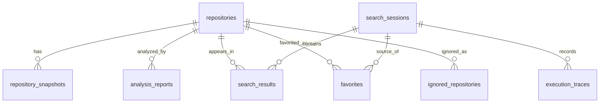

# AgentRadar 架构说明

## 系统边界

AgentRadar 只读取 GitHub 公开仓库资料，不克隆、不执行、不修改被研究仓库。浏览器只访问前端和本项目 API；GitHub Token、数据库连接串等敏感信息全部由后端环境变量管理。

生产编排默认使用 PostgreSQL；直接本地开发可使用 SQLite。前端通过 Nginx 的 `/api/` 反向代理访问后端，因此容器环境不需要向浏览器暴露内部服务名。

## 后端分层

| 层 | 职责 | 主要目录 |
|---|---|---|
| API | 参数校验、依赖注入、HTTP 错误映射 | `backend/app/api` |
| Agent | 搜索状态、节点编排、会话内继续筛选 | `backend/app/agents` |
| Service | 需求解析、过滤、研究、评分、趋势计算 | `backend/app/services` |
| Provider/Tool | 结构化模型调用；GitHub 请求、裁剪、重试、缓存和限流错误 | `backend/app/providers`、`backend/app/tools` |
| Repository | SQLAlchemy 读写和幂等更新 | `backend/app/repositories` |
| Model/Schema | 数据库存储结构和稳定 API 契约 | `backend/app/models`、`backend/app/schemas` |
| Task | 热门项目定时采集 | `backend/app/tasks` |
| Evaluation | 固定 Agent 评测与稳定 Demo 数据 | `backend/app/evaluation`、`backend/app/demo` |

## 智能搜索状态流

节点只传递结构化状态。外部工具失败会记录到 `errors` 和执行轨迹；单个仓库研究失败不会阻断其他候选。工具预算限制搜索轮数、搜索语句数量和深度研究目标数，防止无限循环与成本失控。

会话内继续筛选不会重新调用 GitHub 搜索。系统组合原始需求与追加条件，复用当前候选和已经保存的同等级分析报告，只重新执行初筛、评分和排序。

## 规则与 Agent 职责

V1 把可确定的问题交给规则：去重、fork/归档/过旧过滤、排除项、真实路径校验、趋势计算和六维评分。LangGraph 负责状态编排、失败隔离和可观测轨迹。模型是可选增强层，只参与自然语言需求解析和既有候选的相关度、调查等级判断，不能创建新仓库，也不能绕过排除规则。模型输出必须通过 Pydantic Schema 校验；超时、限流、网络或结构错误会记录错误码并回退到规则结果。

离线评测明确不配置模型，保证 CI 可复现。联网运行启用模型后，每个模型节点会记录调用次数、工具名称和服务返回的总令牌数，用于观察质量与成本；密钥和完整原始响应不进入执行轨迹。

## 数据模型

- `repositories` 保存最新元数据，使用 GitHub ID 和 `full_name` 双重防重；
- `repository_snapshots` 是趋势计算的原始事实，不覆盖历史，并通过来源字段隔离普通搜索、定时采集和演示数据；
- `analysis_reports` 保存能力、工程、证据和阅读路径，继续筛选可以复用；
- `search_sessions`、`search_results`、`execution_traces` 共同支持状态、结果和可解释轨迹；
- `favorites` 与 `ignored_repositories` 独立存储用户动作，忽略规则在深度研究前生效。

## 关键可靠性设计

- GitHub 客户端统一超时、有限重试、TTL 缓存和标准错误码；
- 模型客户端统一超时、有限重试、严格 JSON Schema 和提示注入边界；
- README、文件和目录树都有大小、深度和数量上限；
- 阅读路径只能从真实目录树选取，固定评测要求幻觉率为 0；
- PostgreSQL 使用 Alembic 迁移，容器启动时自动升级到 `head`；
- 热门榜默认只读取定时采集快照，演示数据必须显式开启，历史窗口不足时不返回伪增长；
- 热门采集器只适合单后端副本，多副本部署必须迁移到独立 Worker；
- CI 同时执行静态检查、单元/集成测试、前端构建和 Agent 固定评测。
